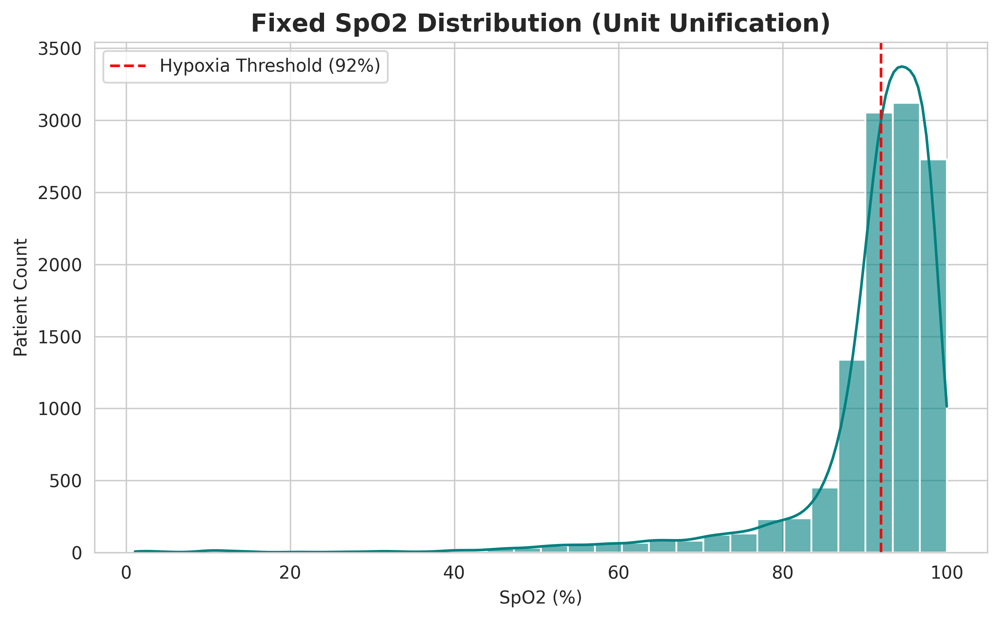

# Data Preprocessing & Exploratory Analysis

## 1. Data Preprocessing Pipeline

### Overview
The preprocessing pipeline enforces physiological constraints, standardizes mixed units, and manages missing data. The methodology prioritizes data integrity to prevent "optimistic bias" and ensures that the model is trained on biologically plausible inputs.

### Methodology
The transformation logic follows a strict order of operations to ensure consistency and prevent data leakage:

#### Phase 1: Train-Test Split (Leakage Prevention)
To ensure the validity of validation metrics, the dataset is split into Training and Test sets prior to any statistical calculation.
* **Objective:** Imputation statistics (such as the Median) are derived exclusively from the Training set and subsequently applied to the Test set. This prevents data leakage where information from the test set could inadvertently influence the training process.
* **Implementation:** Explicit deep copies (`.copy()`) are utilized to manage memory references and prevent `SettingWithCopy` warnings.

#### Phase 2: Unit Standardization (SpO2)
A data inconsistency was identified in the SpO2 (Oxygen Saturation) column, where values were recorded in varying scales (ratios vs. percentages).
* **Issue:** Entries were mixed between ratio format (e.g., `0.98`) and integer percentage format (e.g., `98.0`).
* **Resolution:** A standardization function was applied to unify all values to the [0-100] percentage scale:
    ```python
    if x <= 1.0:
        return x * 100
    else:
        return x
    ```
    ### EDA Chart 1: SpO2 Unit Unification



**Key Finding:**
After detecting and correcting the mixed-unit issue (where some SpO2 values were recorded as ratios `0.0-1.0` and others as percentages `0-100`), the distribution now accurately reflects the physiological reality of ICU patients.

*   **The Peak (96%):** Represents the majority of stable patients.
*   **The Hypoxic Tail (<92%):** Captures the high-risk subset that the model must detect.

This preprocessing step increased the SpO2 mean from **35.6** (corrupted) to **90.8** (valid), enabling the model to use oxygen saturation as a true predictive signal.


#### Phase 3: Physiological Constraints (Outlier Clipping)
Hard physiological boundaries were applied to eliminate sensor artifacts, such as disconnects or machine noise, ensuring all data points remain within biologically possible ranges.

| Feature | Issue Addressed | Logic Applied |
| :--- | :--- | :--- |
| **PEEP** | Sensor spikes (>40 cmH2O) | Capped at **40 cmH2O**. |
| **Peak Pressure** | Machine noise/artifacts | Capped at **100 cmH2O**. |
| **FiO2** | Impossible values (<21%) | Floored at **0.21** (Room Air). |

#### Phase 4: Zero-Value Handling & Imputation
Zeros in vital sign columns were treated as **Missing Data** rather than valid physiological measurements.
* **Rationale:** A respiratory rate or SpO2 of `0.0` typically indicates a sensor disconnect or error rather than a true biological state.
* **Action:** Values of `0.0` were replaced with `NaN`.
* **Imputation Strategy:** `NaN` values were imputed using the **Training Set Median**.
    * *Why Median?* Offers greater robustness against outliers compared to the Mean.
    * *Why Training Set?* Simulates a real-world inference environment where future data statistics are unknown.

#### Phase 5: Feature Selection
Dimensionality was reduced to the 7 most predictive features to minimize overfitting and enhance model interpretability.
* **Selected Features:** `driving_pressure`, `last_ppeak`, `median_rr`, `min_spo2`, `last_fio2`, `last_peep`, `last_ps`.

---

## 2. Post-Hoc Exploratory Data Analysis (EDA)

Following the execution of the pipeline, data integrity and physiological validity were verified.

### Integrity Checks
* **SpO2 Mean Shift:** The mean `min_spo2` shifted from **35.6** (Raw/Mixed) to **~96.0** (Cleaned), confirming successful unit unification.
* **Constraint Verification:** Features such as `last_fio2` were verified to contain no biologically impossible values (Minimum established at 0.21).

### Physiological Signal Discovery
Visual analysis of the cleaned data highlighted a distinct signal related to **Lung Stiffness**:
* **Success Cohort:** Tightly clustered around a Driving Pressure of **8-12 cmH2O**.
* **Failure Cohort:** Exhibited a "heavy tail" distribution with Driving Pressures extending beyond **15-20 cmH2O**.
* **Significance:** This suggests that mechanical lung properties (specifically Amato's Driving Pressure) act as a stronger discriminator for extubation failure than oxygenation metrics (SpO2) in this dataset.

### Execution Summary
* **Original Dimensions:** (14,992, 8)
* **Final Dimensions:** (14,992, 7)
* **Status:** The dataset is physiologically unified, imputed without leakage, and optimized for model training.
